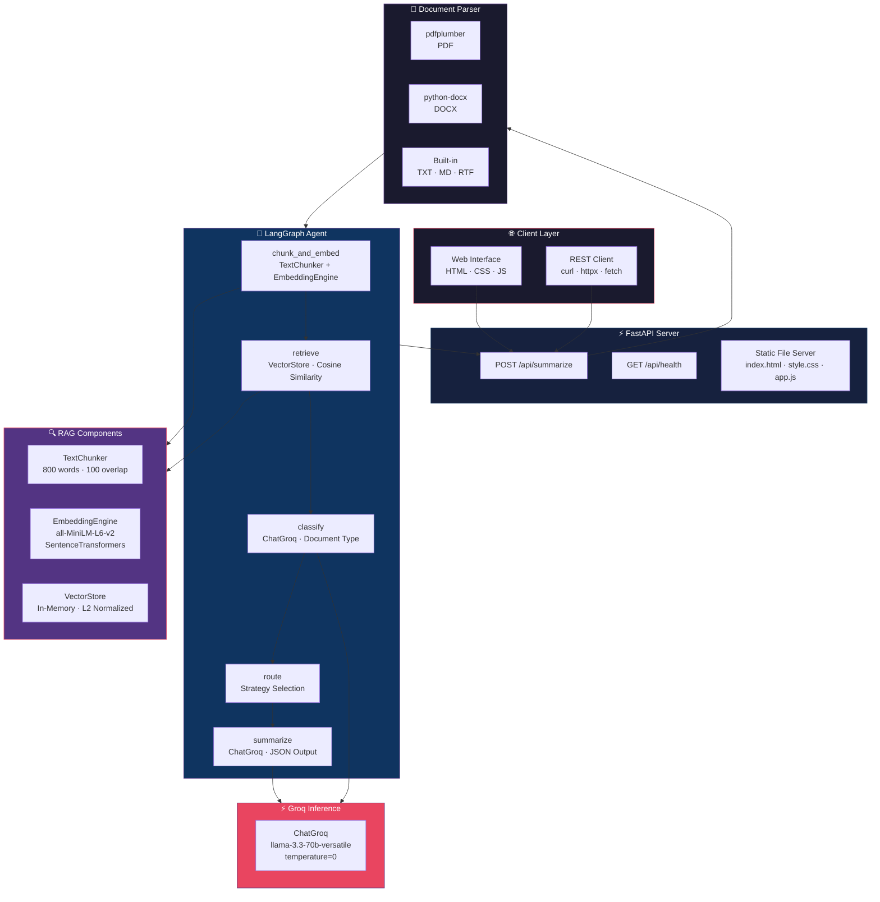
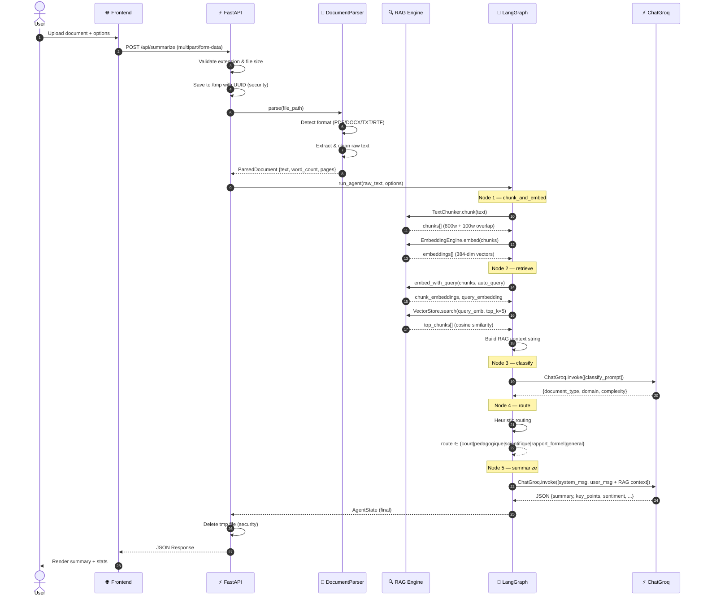
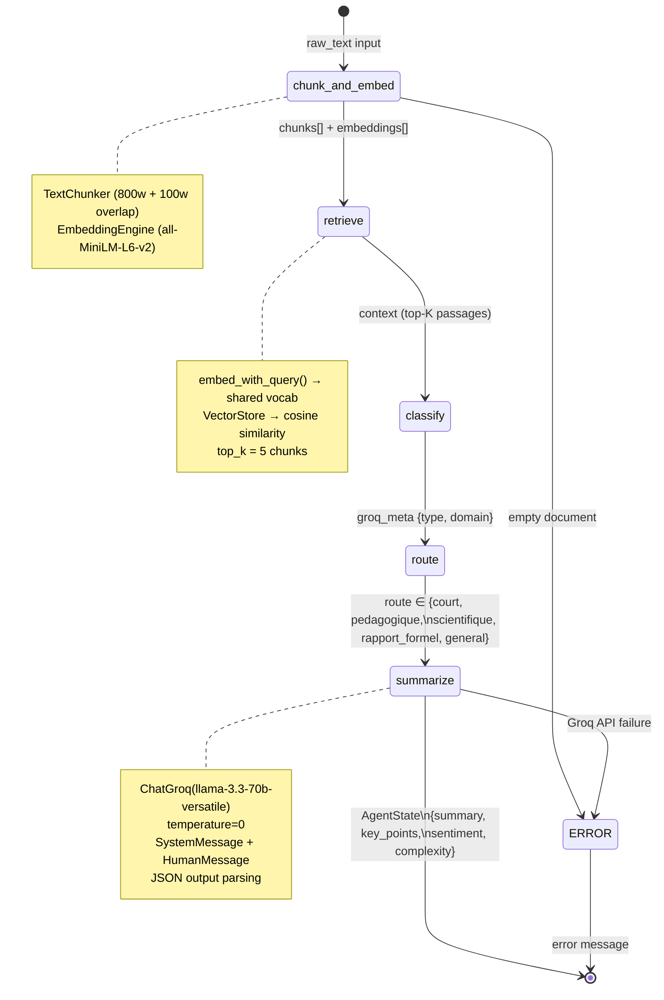
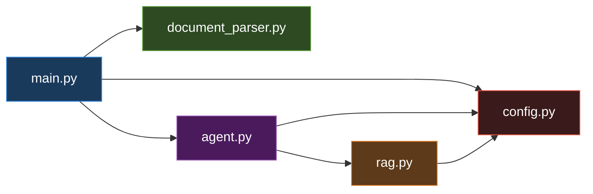

<div align="center">

<!-- ANIMATED BANNER -->


<!-- BADGES -->
<p>
  
  
  
  
  
  
</p>

<p>
  
  
  
</p>

<br/>

> **DocSummarizer** is a production-grade NLP agent that transforms any document —  
> PDF, Word, lesson, report — into a structured, precise, multilingual summary.  
> Powered by **RAG + LangGraph + Groq** with a clean REST API and web interface.

<br/>

[**Live Demo**](#-quick-start) · [**Architecture**](#-architecture) · [**API Reference**](#-api-reference) · [**Contributing**](#-contributing)

</div>

---

## 📋 Table of Contents

- [✨ Features](#-features)
- [🏗 Architecture](#-architecture)
- [🔄 Pipeline Workflow](#-pipeline-workflow)
- [📁 Project Structure](#-project-structure)
- [⚡ Quick Start](#-quick-start)
- [⚙️ Configuration](#️-configuration)
- [📡 API Reference](#-api-reference)
- [🧩 Core Components](#-core-components)
- [🔒 Security](#-security)
- [🛠 Development](#-development)
- [🗺 Roadmap](#-roadmap)

---

## ✨ Features

<table>
<tr>
<td width="50%">

### 🤖 AI-Powered
- **RAG Pipeline** — semantic chunking + cosine similarity retrieval
- **LangGraph Orchestration** — stateful multi-node agent graph
- **ChatGroq LLM** — fast inference on `llama-3.3-70b-versatile`
- **Auto-routing** — detects document type and adapts the summarization strategy

</td>
<td width="50%">

### 📄 Document Support
- ✅ PDF (via `pdfplumber`)
- ✅ Word `.docx` / `.doc`
- ✅ Plain text `.txt` / `.md`
- ✅ Rich Text `.rtf`
- 🔒 Files deleted immediately after processing

</td>
</tr>
<tr>
<td width="50%">

### 🌐 Multilingual Output
- 🇫🇷 Français
- 🇬🇧 English
- 🇲🇦 Arabe
- 🇪🇸 Español

</td>
<td width="50%">

### 🎛 Summary Styles
| Style | Description |
|-------|-------------|
| `concis` | 2–3 paragraphs, straight to the point |
| `detaille` | 4–6 paragraphs, exhaustive |
| `bullet` | Numbered key points list |
| `executif` | Executive report format |
| `pedagogique` | Student-friendly revision sheet |

</td>
</tr>
</table>

---

## 🏗 Architecture



---

## 🔄 Pipeline Workflow



---

## 🔀 LangGraph State Machine



---

## 📁 Project Structure

```
docsummarizer/
│
├── 📄 pyproject.toml          # uv dependencies & build config
├── 🔐 .env.example            # Environment variables template
├── 📖 README.md
│
├── backend/
│   ├── 🔧 config.py           # Pydantic-settings — auto .env discovery
│   ├── 📄 document_parser.py  # PDF · DOCX · TXT · MD · RTF extraction
│   ├── 🔍 rag.py              # TextChunker · EmbeddingEngine · VectorStore
│   ├── 🧠 agent.py            # LangGraph graph — 5 nodes pipeline
│   └── ⚡ main.py             # FastAPI server — REST endpoints
│
└── frontend/
    ├── 🌐 index.html          # Semantic HTML5 + ARIA accessibility
    ├── 🎨 style.css           # Warm palette — CSS variables
    └── ⚙️  app.js              # Drag & drop · API calls · Results rendering
```

**Dependency graph between modules:**



---

## ⚡ Quick Start

### Prerequisites

| Tool | Version | Install |
|------|---------|---------|
| Python | ≥ 3.11 | [python.org](https://python.org) |
| uv | latest | `curl -LsSf https://astral.sh/uv/install.sh \| sh` |
| Groq API Key | — | [console.groq.com](https://console.groq.com) (free) |

### Installation

```bash
# 1. Clone the repository
git clone https://github.com/yourname/docsummarizer.git
cd docsummarizer

# 2. Install dependencies with uv
uv sync

# 3. Configure environment
cp .env.example backend/.env
nano backend/.env
```

**`backend/.env`:**
```env
GROQ_API_KEY=gsk_xxxxxxxxxxxxxxxxxxxx
GROQ_MODEL=llama-3.3-70b-versatile
```

```bash
# 4. Start the server
cd backend
uv run python main.py
```

```
[Config] .env trouvé   : /path/to/backend/.env
[Config] GROQ_API_KEY  : ✅ définie
[Config] GROQ_MODEL    : llama-3.3-70b-versatile
✅  DocSummarizer démarré → http://localhost:8000
```

Open **http://localhost:8000** in your browser. 🚀

---

## ⚙️ Configuration

All settings are defined in `config.py` and overridable via `.env`:

| Variable | Default | Description |
|----------|---------|-------------|
| `GROQ_API_KEY` | *(required)* | Groq API key |
| `GROQ_MODEL` | `llama-3.3-70b-versatile` | ChatGroq model name |
| `EMBEDDING_MODEL` | `all-MiniLM-L6-v2` | Local SentenceTransformer model |
| `CHUNK_SIZE` | `800` | Target chunk size in words |
| `CHUNK_OVERLAP` | `100` | Overlap between consecutive chunks |
| `TOP_K_CHUNKS` | `5` | Number of chunks retrieved by RAG |
| `MAX_FILE_SIZE_MB` | `20` | Maximum upload size |
| `PORT` | `8000` | Server port |
| `DEBUG` | `false` | Enable hot reload |

**Available Groq models:**

```bash
# Fast & efficient
GROQ_MODEL=llama-3.3-70b-versatile   # Best quality
GROQ_MODEL=mixtral-8x7b-32768        # Large context
GROQ_MODEL=gemma2-9b-it              # Lightweight
```

---

## 📡 API Reference

### `POST /api/summarize`

Processes a document and returns a structured summary.

**Request** — `multipart/form-data`:

| Field | Type | Default | Description |
|-------|------|---------|-------------|
| `file` | File | *required* | Document to analyze |
| `style` | string | `concis` | `concis` · `detaille` · `bullet` · `executif` · `pedagogique` |
| `lang` | string | `fr` | `fr` · `en` · `ar` · `es` |
| `detail_level` | int (1–5) | `3` | Verbosity level |
| `include_keypoints` | bool | `true` | Extract key points |
| `include_stats` | bool | `true` | Include figures & stats |
| `include_quotes` | bool | `false` | Include direct quotes |
| `include_entities` | bool | `false` | Extract named entities |
| `include_conclusion` | bool | `true` | Add closing summary |

**Response** — `application/json`:

```json
{
  "success": true,
  "filename": "rapport_q3_2024.pdf",
  "file_type": "PDF",
  "summary": "Ce rapport présente les résultats financiers du troisième trimestre...",
  "key_points": [
    "Croissance du chiffre d'affaires de 18% en glissement annuel",
    "Expansion sur 3 nouveaux marchés européens",
    "Réduction des coûts opérationnels de 12%"
  ],
  "document_type": "Rapport financier",
  "sentiment": "positif",
  "complexity": "intermédiaire",
  "main_topics": ["Finance", "Expansion", "Performance"],
  "stats": {
    "word_count_original": 4820,
    "word_count_summary": 210,
    "compression_ratio": 95.6,
    "page_count": 14,
    "chunk_count": 7,
    "read_time_min": 24
  },
  "pipeline": {
    "route": "rapport_formel",
    "language": "fr",
    "model": "llama-3.3-70b-versatile",
    "provider": "Groq"
  }
}
```

### `GET /api/health`

```json
{
  "status": "ok",
  "groq_ready": true,
  "groq_model": "llama-3.3-70b-versatile",
  "embedding": "all-MiniLM-L6-v2"
}
```

**cURL examples:**

```bash
# Summarize a PDF
curl -X POST http://localhost:8000/api/summarize \
  -F "file=@rapport.pdf" \
  -F "style=executif" \
  -F "lang=fr" \
  -F "detail_level=4" | jq

# Health check
curl http://localhost:8000/api/health | jq
```

---

## 🧩 Core Components

### RAG Pipeline — `rag.py`

```python
# Three-stage retrieval pipeline

# Stage 1 — Chunking with overlap
chunker = TextChunker(chunk_size=800, overlap=100)
chunks = chunker.chunk(raw_text)  # preserves paragraph coherence

# Stage 2 — Embedding (shared vocabulary — fixes dimension mismatch bug)
engine = EmbeddingEngine("all-MiniLM-L6-v2")
chunk_embeddings, query_embedding = engine.embed_with_query(chunks, query)
# ↑ Both encoded together → guaranteed same vector dimension

# Stage 3 — Cosine similarity search
store = VectorStore()
store.add_chunks([Chunk(text=t, index=i, embedding=e) for ...])
top_chunks = store.search(query_embedding, top_k=5)
```

> **Key design decision:** `embed_with_query()` encodes chunks and query **in a single batch** using a shared vocabulary. This prevents the `shapes (83,) and (362,) not aligned` dimension mismatch that occurs when using separate TF-IDF calls.

### LangGraph Agent — `agent.py`

```python
# Graph definition
builder = StateGraph(AgentState)

builder.add_node("chunk_and_embed", node_chunk_and_embed)  # RAG chunking
builder.add_node("retrieve",        node_retrieve)          # Top-K retrieval
builder.add_node("classify",        node_classify)          # Doc classification
builder.add_node("route",           node_route)             # Strategy routing
builder.add_node("summarize",       node_summarize)         # LLM generation

builder.add_edge(START,             "chunk_and_embed")
builder.add_edge("chunk_and_embed", "retrieve")
builder.add_edge("retrieve",        "classify")
builder.add_edge("classify",        "route")
builder.add_edge("route",           "summarize")
builder.add_edge("summarize",       END)

graph = builder.compile()
```

### ChatGroq Integration — `agent.py`

```python
llm = ChatGroq(
    model=settings.groq_model,
    api_key=settings.groq_api_key,
    temperature=0,
)

response = llm.invoke([
    SystemMessage(content=system_prompt),
    HumanMessage(content=user_prompt_with_rag_context),
])
```

---

## 🔒 Security

| Concern | Implementation |
|---------|----------------|
| **File storage** | UUID-named temp files, deleted immediately after processing |
| **Path traversal** | Extension whitelist + UUID filenames — no user input in paths |
| **File size** | Configurable limit (default 20 MB) enforced before disk write |
| **API keys** | Loaded from `.env`, never logged or exposed in responses |
| **CORS** | Configurable — restrict `allow_origins` in production |

```python
# Security flow in main.py
tmp_path = os.path.join(settings.upload_dir, f"{uuid.uuid4().hex}{ext}")
try:
    # ... process ...
finally:
    if os.path.exists(tmp_path):
        os.remove(tmp_path)   # Always deleted, even on error
```

---

## 🛠 Development

### Run tests

```bash
uv run pytest tests/ -v
```

### Lint & format

```bash
uv run ruff check backend/
uv run ruff format backend/
```

### Run with hot reload

```bash
cd backend
DEBUG=true uv run python main.py
```

### Test the full pipeline locally

```bash
cd backend
python3 -c "
from document_parser import DocumentParser
from agent import run_agent

parsed = DocumentParser().parse('your_doc.pdf', 'your_doc.pdf')
result = run_agent(
    raw_text=parsed.raw_text,
    filename='your_doc.pdf',
    style='concis',
    language='fr',
    detail_level=3,
)
print(result['summary'])
print(result['key_points'])
"
```

---

## 🗺 Roadmap

- [x] RAG pipeline with cosine similarity
- [x] LangGraph multi-node agent
- [x] ChatGroq integration (llama-3.3-70b)
- [x] Multi-format document support (PDF, DOCX, TXT, MD, RTF)
- [x] Multilingual output (FR, EN, AR, ES)
- [x] Web interface with drag & drop
- [ ] Persistent vector store (ChromaDB / FAISS)
- [ ] Streaming response (SSE)
- [ ] Batch processing — multiple documents
- [ ] Docker & docker-compose
- [ ] Authentication (API key / OAuth2)
- [ ] Export to PDF / DOCX
- [ ] Conversation mode — ask follow-up questions on the document

---

## 🤝 Contributing

```bash
# Fork → clone → branch
git checkout -b feat/your-feature

# Develop, test, lint
uv run pytest
uv run ruff check backend/

# Commit with conventional commits
git commit -m "feat(rag): add persistent ChromaDB store"

# Open a Pull Request
```

---

<div align="center">


**Built with** ❤️ **using RAG · LangGraph · Groq · FastAPI · uv**

</div>